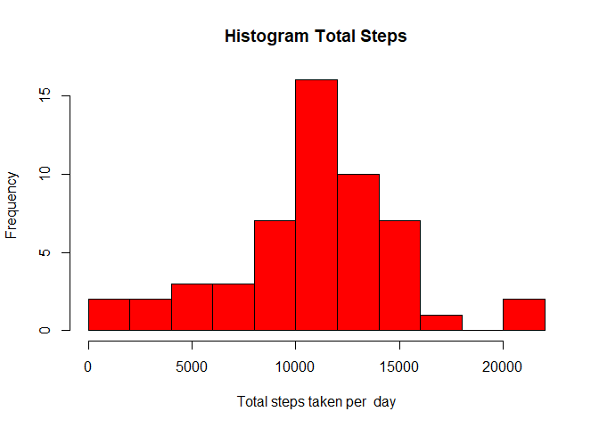
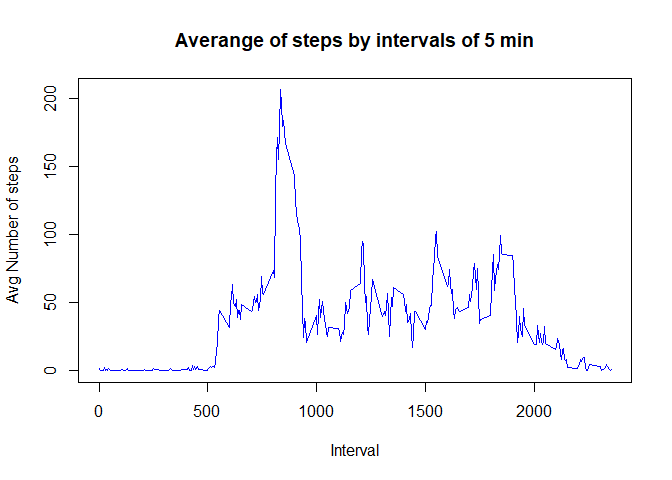
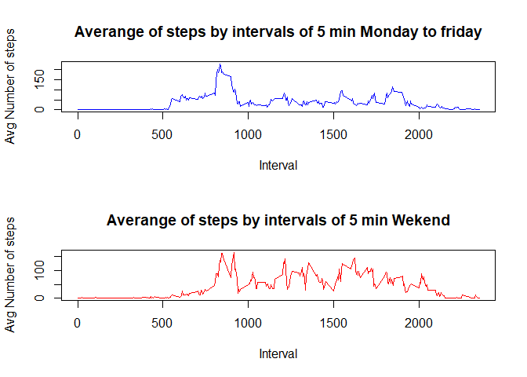

## Loading and preprocessing the data

The first step is load the libraries and prepossessing the data to can use before to analyse the data, so we need to unzip the file and open in a table

``` r
library(tidyverse)
```

```         
## ── Attaching core tidyverse packages ──────────────────────── tidyverse 2.0.0 ──
## ✔ dplyr     1.1.2     ✔ readr     2.1.4
## ✔ forcats   1.0.0     ✔ stringr   1.5.0
## ✔ ggplot2   3.4.2     ✔ tibble    3.2.1
## ✔ lubridate 1.9.2     ✔ tidyr     1.3.0
## ✔ purrr     1.0.2     
## ── Conflicts ────────────────────────────────────────── tidyverse_conflicts() ──
## ✖ dplyr::filter() masks stats::filter()
## ✖ dplyr::lag()    masks stats::lag()
## ℹ Use the conflicted package (<http://conflicted.r-lib.org/>) to force all conflicts to become errors
```

``` r
library(dplyr)
library(janitor)
```

```         
## 
## Attaching package: 'janitor'
## 
## The following objects are masked from 'package:stats':
## 
##     chisq.test, fisher.test
```

``` r
library(lubridate)
library(ggplot2)
library(data.table)
```

```         
## 
## Attaching package: 'data.table'
## 
## The following objects are masked from 'package:lubridate':
## 
##     hour, isoweek, mday, minute, month, quarter, second, wday, week,
##     yday, year
## 
## The following objects are masked from 'package:dplyr':
## 
##     between, first, last
## 
## The following object is masked from 'package:purrr':
## 
##     transpose
```

``` r
zipfile <- "activity.zip"
data_out <- "data_unzip"
unzip(zipfile, exdir = data_out)
```

To can use the data we need to load file in an table, review how is the data organized, the dimession and the structure

``` r
df <- read.table("data_unzip/activity.csv",stringsAsFactors=FALSE, header = TRUE, sep = ",")
head(df)
```

```         
##   steps       date interval
## 1    NA 2012-10-01        0
## 2    NA 2012-10-01        5
## 3    NA 2012-10-01       10
## 4    NA 2012-10-01       15
## 5    NA 2012-10-01       20
## 6    NA 2012-10-01       25
```

``` r
dim(df)
```

```         
## [1] 17568     3
```

``` r
str(df)
```

```         
## 'data.frame':    17568 obs. of  3 variables:
##  $ steps   : int  NA NA NA NA NA NA NA NA NA NA ...
##  $ date    : chr  "2012-10-01" "2012-10-01" "2012-10-01" "2012-10-01" ...
##  $ interval: int  0 5 10 15 20 25 30 35 40 45 ...
```

In the structure we can see that the colum date is not in the correct format so, we transform as a date format

``` r
df$date <- as.Date(df$date, format = "%Y-%m-%d")
str(df)
```

```         
## 'data.frame':    17568 obs. of  3 variables:
##  $ steps   : int  NA NA NA NA NA NA NA NA NA NA ...
##  $ date    : Date, format: "2012-10-01" "2012-10-01" ...
##  $ interval: int  0 5 10 15 20 25 30 35 40 45 ...
```

Now we have a dataframe prepossessed

## What is mean total number of steps taken per day?

Fist we obtained the sum o total steps for each day

and then we plot a histogram

``` r
total_steps <- df %>%
  group_by(date) %>%
  summarise(total_steps = sum(steps), na.rm=TRUE)
hist(total_steps$total_steps, breaks = 10, col="red",xlab = "Total steps taken per  day", main = "Histogram Total Steps")
```

<!-- --> and finally we obtain the mean, median and max

``` r
print(max(total_steps$total_steps, na.rm = TRUE))
```

```         
## [1] 21194
```

``` r
print(mean(total_steps$total_steps, na.rm = TRUE))
```

```         
## [1] 10766.19
```

``` r
print(median(total_steps$total_steps,na.rm = TRUE))
```

```         
## [1] 10765
```

## What is the average daily activity pattern?

The averange of daily activity pattern we can see in the next plot First we obtain a table with the averega by pattern

``` r
avg_day <- aggregate(df$steps, by = list(df$interval), 
                     FUN = mean, na.rm= TRUE)
```

And then we plot it

``` r
plot(avg_day$Group.1, avg_day$x, type= "l" , col = "blue", xlab= "Interval", ylab= "Avg Number of steps", main = "Averange of steps by intervals of 5 min")
```

<!-- -->

## Imputing missing values

In the original data frame there are NA values, we completed that NA, to the mean of the intervals

``` r
df_not_na <- df
df_not_na <- mutate(df_not_na,week_day = wday(df$date))
p <- 0
for (n in 1:61){
  for (m in 1:288){
    p <- p+1
    if (is.na(df_not_na$steps[p])){
      df_not_na$steps[p] <- avg_day$x[m]
      }
  }   
}
```

Verify if there is not any NA

``` r
sum(is.na(df_not_na))
```

```         
## [1] 0
```

## Are there differences in activity patterns between weekdays and weekends?

Is necessary separate in weekday and weekend to understand the differences between them

``` r
workday <-  subset(df_not_na,week_day >1 & week_day <7 )
weekend <- subset(df_not_na, week_day ==1 | week_day ==7)
avg_work <- aggregate(workday$steps, by = list(workday$interval), 
                     FUN = mean)

avg_weekend <- aggregate(weekend$steps, by = list(weekend$interval), 
                     FUN = mean)
```

Plot to view the differences

``` r
par(mfrow = c(2,1))
plot(avg_work$Group.1, avg_work$x, type= "l" , col = "blue", xlab= "Interval", ylab= "Avg Number of steps", main = "Averange of steps by intervals of 5 min Monday to friday")
plot(avg_weekend$Group.1, avg_weekend$x, type= "l" , col = "red", xlab= "Interval", ylab= "Avg Number of steps", main = "Averange of steps by intervals of 5 min Wekend")
```

<!-- -->
